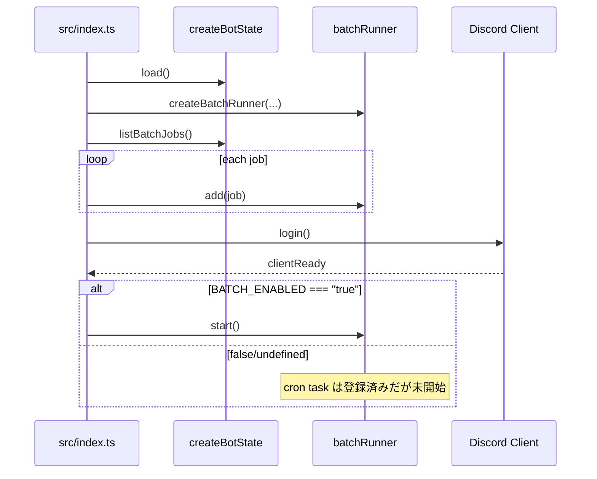
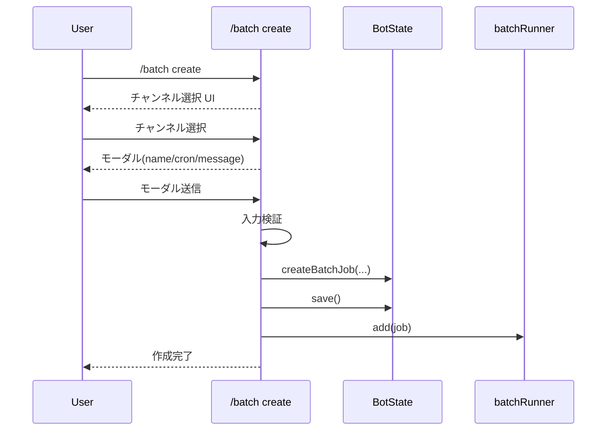
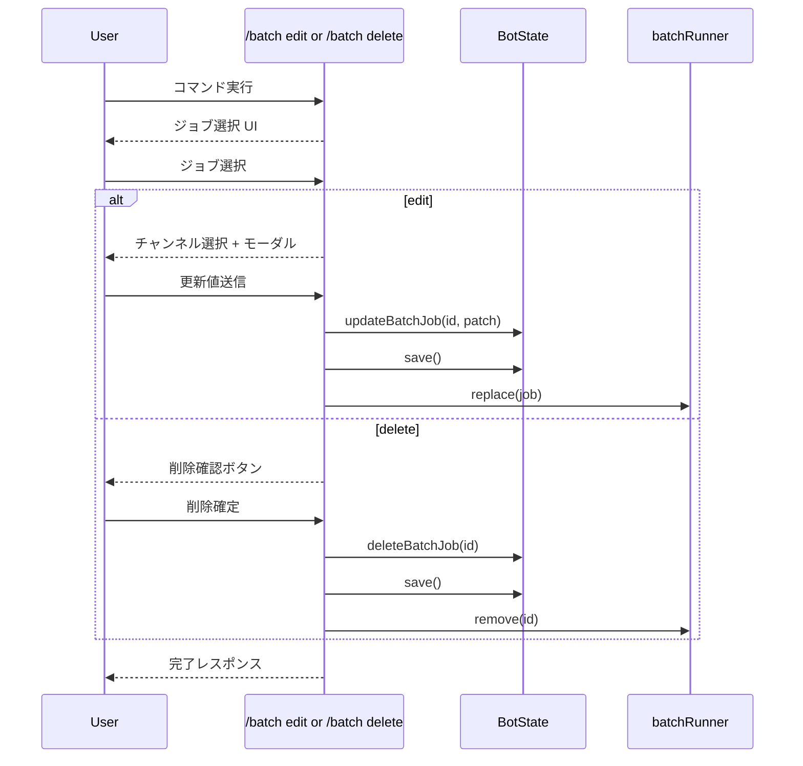
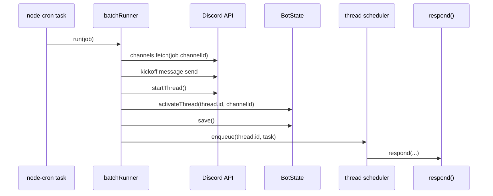

# バッチ処理の仕組み

このプロジェクトのバッチは、`node-cron` を使って Bot プロセス内で `BatchJob` を実行する構成です。  
静的な `jobs/*.ts` / `schedule.ts` は廃止され、ジョブは `/batch` スラッシュコマンド経由で作成・更新・削除されます。

## 全体像

- 実行基盤: `src/batch/runner.ts`
- 型定義: `src/batch/types.ts`（`BatchJob`）
- 永続化: `src/bot/state/store.ts`（`.state.json` の `batchJobs`）
- コマンド入口: `src/bot/slash-commands/commands/batches/index.ts`
- 起動時接続: `src/index.ts`

実行フローは次の通りです。

1. `createBatchRunner(...)` でランナーを生成
2. `state.listBatchJobs()` から復元したジョブを `batchRunner.add(job)` で登録
3. `BATCH_ENABLED === 'true'` の場合のみ `clientReady` で `batchRunner.start()`
4. cron 発火で `run(job)` が実行され、対象チャンネルにキックオフ投稿→スレッド作成→`respond(...)` 実行

## データモデル

`src/batch/types.ts`:

- `BatchJob`
  - `id: string`
  - `name: string`
  - `cron: string`
  - `channelId: string`
  - `message: string`

## State API（Batch 関連）

`src/bot/state/store.ts` の公開 API:

- `listBatchJobs(channelId?)`
- `getBatchJob(id)`
- `createBatchJob({ name, cron, channelId, message })`
- `updateBatchJob(id, patch)`
- `deleteBatchJob(id)`

保存キーは `batchJobs`（配列）です。`save()` 時に `id` 昇順で永続化されます。

## BatchRunner API

`src/batch/runner.ts` の公開 API:

- `add(job)`
- `remove(jobId)`
- `replace(job)`
- `start()`
- `stop()`

### 重複実行ガード

`runningJobs: Set<string>` で同一 `job.id` の同時実行を防止しています。

- 実行中なら `ジョブ重複スキップ` をログ出力
- 開始時 `runningJobs.add(job.id)`
- `finally` で `runningJobs.delete(job.id)`

## `/batch` コマンド構成

`src/bot/slash-commands/commands/batches/`:

- `index.ts`: ルーター（ChatInput / Select / Modal / Button の振り分け）
- `create.ts`: 作成フロー
- `edit.ts`: 編集フロー
- `list.ts`: 一覧/詳細表示
- `delete.ts`: 削除フロー
- `lib/constants.ts`: customId・長さ制限などの共通定数
- `lib/components.ts`: 共通 UI ビルダー（ジョブ選択、チャンネル選択）
- `lib/inputs.ts`: 共通入力ユーティリティ（trim、cron validation、customId prefix parse）

## `/batch` の挙動

- `list`
  - ジョブ選択 UI を表示
  - 選択ジョブの詳細（name/cron/channel/message）を表示
- `create`
  - チャンネル選択 → モーダル入力（name/cron/message）
  - 成功時に `state.createBatchJob` + `batchRunner.add`
- `edit`
  - ジョブ選択 → チャンネル選択 → モーダル入力
  - 成功時に `state.updateBatchJob` + `batchRunner.replace`
- `delete`
  - ジョブ選択 → ボタン確認
  - 成功時に `state.deleteBatchJob` + `batchRunner.remove`

## シーケンス

### 起動時（ジョブ復元と開始）

### `/batch create`

### `/batch edit` / `/batch delete`

### cron 実行時

## 有効化条件

バッチ実行開始は `src/index.ts` で以下の条件です。

- `DISCORD_TOKEN` が設定済み
- `BATCH_ENABLED === 'true'`
- `clientReady` 到達後に `batchRunner.start()`

※ ジョブ登録自体（`add`）は起動時に常に行われます。`start()` しない限り cron は動きません。

## ログ確認ポイント

`[batch]` プレフィックスの主ログ:

- `スケジュール登録`
- `スケジュール解除`
- `ジョブ開始` / `ジョブ完了`
- `ジョブ失敗`
- `ジョブ重複スキップ`

運用時は以下を確認:

- `BATCH_ENABLED` の値
- `batchJobs` の内容（`name`, `cron`, `channelId`）
- Bot の投稿/スレッド作成権限
- 実行環境のタイムゾーン（`node-cron` の時刻解釈）
